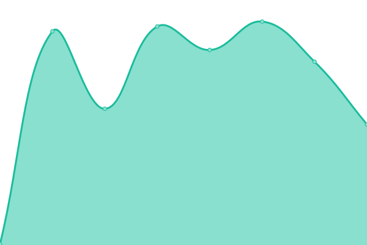

# [📈 Live Status](https://shouge.github.io/uptime): <!--live status--> **🟩 All systems operational**

This repository contains the open-source uptime monitor and status page for [Tao Rao](https://shouge.github.io/uptime), powered by [Upptime](https://github.com/upptime/upptime).

With [Upptime](https://upptime.js.org), you can get your own unlimited and free uptime monitor and status page, powered entirely by a GitHub repository. We use [Issues](https://github.com/shouge/uptime/issues) as incident reports, [Actions](https://github.com/shouge/uptime/actions) as uptime monitors, and [Pages](https://shouge.github.io/uptime) for the status page.

<!--start: status pages-->
<!-- This summary is generated by Upptime (https://github.com/upptime/upptime) -->
<!-- Do not edit this manually, your changes will be overwritten -->
<!-- prettier-ignore -->
| URL | Status | History | Response Time | Uptime |
| --- | ------ | ------- | ------------- | ------ |
|  [Proxy HongKong](https://hk.shouge.host) | 🟩 Up | [proxy-hong-kong.yml](https://github.com/shouge/uptime/commits/HEAD/history/proxy-hong-kong.yml) | 

 693ms
     
 | 

<a href="https://status.shouge.host/history/proxy-hong-kong">98.93%</a>
    

|  [Proxy Japan](https://jp.node.shouge.host) | 🟩 Up | [proxy-japan.yml](https://github.com/shouge/uptime/commits/HEAD/history/proxy-japan.yml) | 

 496ms
     
 | 

<a href="https://status.shouge.host/history/proxy-japan">100.00%</a>
    

|  [Uptime Status](https://status.shouge.host) | 🟩 Up | [uptime-status.yml](https://github.com/shouge/uptime/commits/HEAD/history/uptime-status.yml) | 

 153ms
     
 | 

<a href="https://status.shouge.host/history/uptime-status">100.00%</a>
    

|  [Worker Proxy](https://worker-proxy.yaofan.online) | 🟩 Up | [worker-proxy.yml](https://github.com/shouge/uptime/commits/HEAD/history/worker-proxy.yml) | 

 110ms
     
 | 

<a href="https://status.shouge.host/history/worker-proxy">100.00%</a>
    

<!--end: status pages-->

[**Visit our status website →**](https://shouge.github.io/uptime)

## 📄 License

- Powered by: [Upptime](https://github.com/upptime/upptime)
- Code: [MIT](./LICENSE) © [Anand Chowdhary](https://anandchowdhary.com), supported by [Pabio](https://pabio.com)
- Data in the `./history` directory: [Open Database License](https://opendatacommons.org/licenses/odbl/1-0/)
