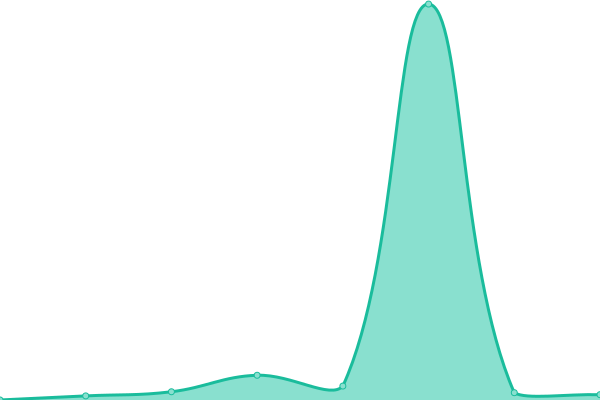

# [📈 Live Status](https://status.shouge.me): <!--live status--> **🟥 Complete outage**

This repository contains the open-source uptime monitor and status page for [Tao R](shouge.me), powered by [Upptime](https://github.com/upptime/upptime).

With [Upptime](https://upptime.js.org), you can get your own unlimited and free uptime monitor and status page, powered entirely by a GitHub repository. We use [Issues](https://github.com/shouge/uptime/issues) as incident reports, [Actions](https://github.com/shouge/uptime/actions) as uptime monitors, and [Pages](https://demo.upptime.js.org) for the status page.

<!--start: status pages-->
<!-- This summary is generated by Upptime (https://github.com/upptime/upptime) -->
<!-- Do not edit this manually, your changes will be overwritten -->
<!-- prettier-ignore -->
| URL | Status | History | Response Time | Uptime |
| --- | ------ | ------- | ------------- | ------ |
|  [PROXY_NODE_2](https://proxy-node2.shouge.repl.co/55d90fe9-556c-438a-995c-24328f5cdc31) | 🟥 Down | [proxy-node-2.yml](https://github.com/shouge/uptime/commits/HEAD/history/proxy-node-2.yml) | 

 2409ms
     
 | 

<a href="https://status.shouge.me/history/proxy-node-2">0.00%</a>
    

|  [PROXY_NODE_1](https://proxy-node1.shouge.repl.co/d6c41e25-f9d3-4fae-be9d-30dfa0fca332) | 🟥 Down | [proxy-node-1.yml](https://github.com/shouge/uptime/commits/HEAD/history/proxy-node-1.yml) | 

 3162ms
     
 | 

<a href="https://status.shouge.me/history/proxy-node-1">0.00%</a>
    

<!--end: status pages-->

[**Visit our status website →**](https://demo.upptime.js.org)

## 📄 License

- Powered by: [Upptime](https://github.com/upptime/upptime)
- Code: [MIT](./LICENSE) © [Tao R](shouge.me)
- Data in the `./history` directory: [Open Database License](https://opendatacommons.org/licenses/odbl/1-0/)
